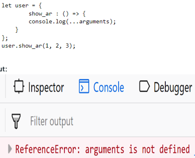

1- JavaScript, 1995 yılında Brendan Eich tarafından geliştirilmiş ilk adı 'Mocha' olan ve o zamanlar web tarayıcısı olan Netscape Navigator için tasarlanan bir betik dilidir. JavaScript sonradan LiveScript olarak biliniyordu ve 1997'de JavaScript olarak adlandırıldı. JavaScript web sitelerinin dinamik olmasına katkı sağlar. Client ve server taraflı çalışabilir.

1995-1997: ECMA-262 standardı haline geldi. Bu dönemde, JavaScript'in kullanım amacı, web sayfalarına etkileşimli öğeler eklemekti.

Mozilla ve Netscape Sonrası: Netscape, JavaScript'i ECMA'ya devrettikten sonra, Mozilla Foundation JavaScript'i Firefox tarayıcısı için geliştirmeye devam etti. 

Günümüz: Google'ın V8 motorunun oluşturulması, JavaScript'in tarayıcı dışında da çalışabilmesini sağladı. Ryan Dahl Node.js'i yayınladı. Node.js, JavaScript'in tarayıcı dışında kullanılmasını sağlayan açık kaynaklı bir JavaScript çalışma zamanı ortamıdır. Bu sayede JavaScript, mobil uygulamalardan masaüstü uygulamalara ve backend sunuculara kadar birçok alanda kullanılabilecek popüler bir dil haline geldi.

2- Java, OOP bir programlama dilidir. Hem sunucu tarafında hem de istemci tarafında kullanılabilir. Genellikle büyük ölçekli uygulamalar, mobil uygulamalar, işletim sistemleri ve ağ uygulamaları gibi çeşitli alanlarda kullanılır.

JavaScript ise ilk olarak tarayıcılarda web sayfalarını etkileşimli hale getirmek için oluşturulmuş bir tarayıcı tarafı betik dilidir. Ancak günümüzde, sunucu taraflı geliştirme (Node.js gibi) ve mobil uygulamalar gibi çeşitli alanlarda da kullanılır.

Java ve JavaScript arasındaki temel farklar ise:

- Java, genel amaçlı bir dildir, JavaScript ise web geliştirme için tasarlanmıştır.
- Java, sunucu tarafında veya istemci tarafında kullanılabilir, JavaScript ise yalnızca istemci tarafında kullanılabilir.
-Java, derlenmesi gereken statik tipli bir dildir, JavaScript ise yorumlanan dinamik tipli bir dildir.
- Java, bir e-ticaret sitesi veya bir kurumsal uygulama gibi karmaşık bir web uygulaması oluşturmak için kullanılabilir. JavaScript ise bir web sitesine etkileşimli bir menü veya bir kaydırma özelliği eklemek için kullanılabilir.

3- JavaScript'te iki farklı veri türü vardır:

- Primitive Data Types (İlkel Veri Tipi):
  Değişmez... 
  String, Number, Boolean, BıgInt, Null

- Non-primitive Data Type (İlkel Olmayan(Referans) Veri Tipi)
  Değiştirilebir ...
  Object, Functions, Array

4- null, object dir çünkü typeof sonucu bir object döndürür. 

undefined ise, değişken var ama bir değer verilmemiştir.

5- NaN, hesaplamalarda yapılan bir hatayı belirtir.
Örnek, alert("ece")/2; //NaN döner. sayı değil

6- eğer tek satırı yorum satırı olarak alacaksam ; // ile.
eğer birden fazla satırı yorum satırı olarak alacaksam ; /* */  ile kullanırım.

7- Global Değişken, 
   her yerden erişilmesi gereken değerleri saklamak için kullanılır fakat tanımlanan fonksiyonların dışında belirtilmelidir. herhangi bir fonksiyon içinde değiştirilebilirler. Hatalar ve karışıklıklarla karşılaşma olasılığı çok yüksek o yüzden local değişkenleri kullanmak tavsiye edilir.

8- this,
Çağrıldığı nesneyi belirtir. Değeri ise çağrıldığı yere göre değişir. 
Örnek: 
 ![buradaki this ise listItems[x] i temsil eder](image.png)

9- ==, eğer iki değer de aynı tipte ise, değişkenlerin tiplerini eşitler. Değerler eşitse true döndürür, değilse false döndürür. Örnek:        null==undefined    "  true  "
   === , değerlerin ve veri tiplerinin aynı olup olmadığını kontrol eder. Örnek: null===undefined   " false   "
 
10- 
let | var  | const 
--------------------- | ---------------------- | ---------------------------
Blok kapsamlı element |  Standart bir değişken tanımlamada kullanırız | Sabit değişken tanımlamada kullanırız(blok kapsamı dahilindedir)
--------------------- | ---------------------- | ---------------------------
değişken tekrar oluşturulmaz |  aynı değişken tanımlamalarında en son değişkenin tuttuğu veri geçerlidir |  aynı değişken isminden tekrar oluşturamazsın.
--------------------- | ---------------------- | ---------------------------
ister ilk değer ata ister atama |  ilk değer atamazsak undefined döner | ilk değer atamak zorundayız 

11- Normal fonksiyon, hem çağırılabilir hem de yapılandırılabilir olduğundan, 'new' anahtar sözcüğü kullanılarak çağrılabilirler. Ancak, arrow fonksiyon yalnızca "çağrılabilir", yapılandırılamaz ve contructor olarak kullanılamazlar. Çalışma zamanı hatası alırız.

12- let i = 2;
switch (i) {
  case 1:
    let a = 1;
    console.log(a);
    break;
  case 2:
    let b = 2;
    console.log(b);
    break;
  default:
}

13- Sadece aldığı aynı girdiyi baz alarak aynı sonucu üretir ve dışarıya herhangi bir etkisi yok.

14- fonksiyon tanımının parametreleri içinde kullanılan ... noktayı temsil eder. bütün argümanları bir dizide toplar.
 Gönderilecek tüm argümanları toplar bu yüzden son parametreden önce rest'i eklemenin bir anlamı kalmıyor.
 function sum(...nums) {
    let a = 0;
    for (let num of nums) 
    a += num;
    return console.log(a)
  }

15- birden çok değişken tanımlamak yerine object destructuring kullanabiliriz şu şekilde: nesnenin verilerine erişmek istediğimizde Property lerini veya fonksiyonunu kullanırız. 

const TC = {isim: 'ece', yas: 21 }
const { isim } = TC // buradaki isim değişkeni object destructing ile atandı

16- 1. const object = { isim: 'ece', yas: 21 };

2. const isim = "ece";
const yas = 21;
const object2 = { isim, yas };

3. const obj3 = {};
object3.isim = "ece";
object3.yas = 21;

4. const object4 = new Object();
object4.isim = "ece";
object4.yas = 21;

5. const object5 = Object.create(null);
object5.isim = "ece";
object5.yas = 21;

6. const object6 = Object.assign({}, { isim: "ece", yas: 21 });

17-  1. const object = {
    isim: 'ece',
    yas: '21'
}

const newObject = {}
for(const key in object){
    const value = object[key];
    const sum = value.length;
    newObject[key] = sum;
}
console.log(newObject)

2.  let object = {
    isim: 'ece',
    yas: '26'
}

const newObject  = {}
Object.entries(object).forEach(([value, key]) => {
    newObject[value] = key.length
})

console.log(newObject)

18-
Cookie | local storage  | session storage
--------------------- | ---------------------- | ---------------------------
4 kb a kadar veri depolamaya sahip |  5 kb a kadar veri depolamaya sahip | 5 kb a kadar veri depolamaya sahip
--------------------- | ---------------------- | ---------------------------
Hem sunucu hem istemci tarafından erişilebilir | istemci tarafından erişilebilir |  istemci tarafından erişilebilir 
--------------------- | ---------------------- | ---------------------------
string verileri depolama |  string, number, vb. her türlü veriyi depolama | string, number, vb. her türlü veriyi depolama
--------------------- | ---------------------- | ---------------------------
Belirli süreye kadar verileri tutar	 |  silinene kadar verileri tutar | sekme kapanana kadar verileri tutar

19- Senkron'da bir işlem tamamlanmadan diğer işleme geçilmez. asenkron' da işlemler aynı anda başlar ve birbirlerini beklemeden devam ederler. İşlem sonuçları hangi işlemin önce tamamlandığına göre (kendi tamamlanma sürelerine bağlı) döner.

20- asenkron işlemleri yönetmek ve kontrol etmek için kullanılır. önemli durumları: Pending(waıtıng) , Fullfilled(success), reject (error)

